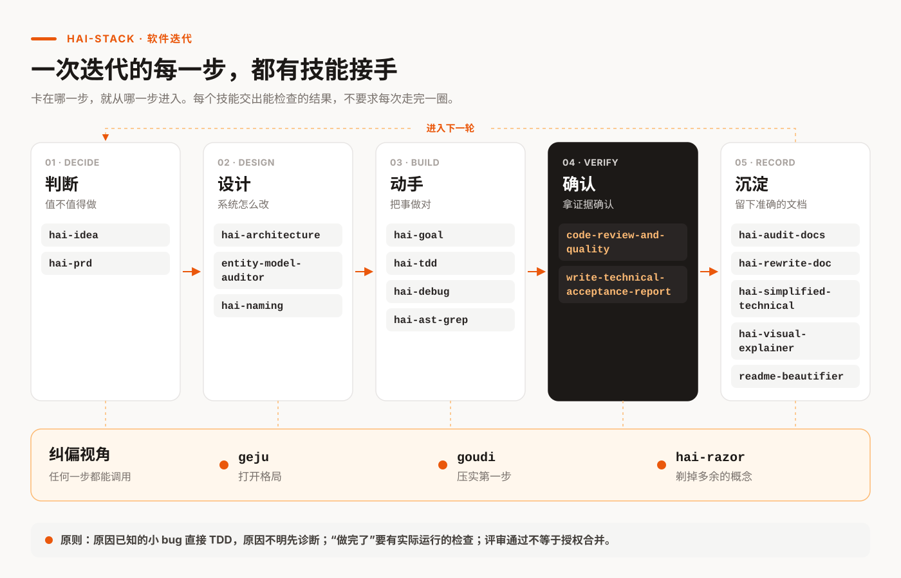

# hai-stack

> 让 Coding Agent 把软件迭代做对：从真实问题出发，完成改动，用证据确认结果。

[](#能力一览)
[](LICENSE)
[](#安装)

**支持：大多数能读取 Skills（`SKILL.md`）的 Coding Agent，例如 Claude Code、Codex。**

hai-stack 由 [@海拉鲁编程客](https://github.com/hylarucoder) 创建。它把一次软件迭代拆成判断、设计、动手、确认、沉淀五步，每一步都有对应的技能。

[快速开始](#快速开始) · [能力一览](#能力一览) · [安装](#安装) · [怎样知道技能有用](#怎样知道技能有用) · [参与维护](CONTRIBUTING.md)



## hai-stack 解决什么问题

你不需要先学一套流程，也不需要记住技能名。说出当前的卡点，对应的技能接手，交出能检查的结果。

| 真实处境 | 你会得到 |
| --- | --- |
| 想做一个功能，不确定是不是伪需求 | 一个明确的判断（做、先验证、换题、搁置或砍掉），最强的反对意见，成本最低的验证 |
| 系统太绕，改一个配置要动很多地方 | 从运行入口追出的调用链、证据和实质不同的方案 |
| 线上出故障，原因不清楚 | 复现步骤、排除过的假设和因果链；要求修复时继续修好并验证 |
| 改完一版，想知道有没有问题 | 有证据的缺陷、修复方向和限定范围的评审结论 |
| 方案被兼容和历史包袱困住，或者太飘、落不了地 | 打开格局后的干净目标，或者压实的第一步和止损规则 |
| 文档和代码对不上，或者写得含糊 | 有证据的修复，或者一个词一个意思、一句一件事的改写 |

## 快速开始

安装后，在你用的 Coding Agent 里直接说出卡点：

```text
线上把 RETRY_ENABLED=false 后仍重复请求，本地却正常。先定位原因，不要改代码。
```

`hai-debug` 接手。它交回复现步骤、排除过的假设和因果链，不改代码。

其他常见的说法：

```text
我想加一个 AI 命令推荐器，但不确定是不是伪需求，值得投入两周吗？
系统太绕了，从 server 和 worker 入口看看为什么改重试规则这么费劲。
review 当前 diff，优先找真实 bug 和缺少的验证。
对照实现检查并修复 README，批准的未来需求不要改成现有行为。
这份 runbook 写得太绕，按简化技术中文改一遍，意思不要变。
把格局打开。 / 用苟帝压实第一步。 / 用剃刀看看哪些概念该合并。
```

## 能力一览

| 工作目标 | 技能 | 常见产出 |
| --- | --- | --- |
| **判断** | | |
| 判断值不值得投入 | `hai-idea` | 判断、关键假设、成本最低的验证 |
| 定清用户需要什么行为 | `hai-prd` | 范围、场景、可验收的要求；小事可以不写 PRD |
| **设计** | | |
| 看清系统为什么难改，决定边界怎么调整 | `hai-architecture` | 全局运行链调查或局部设计决策（含 React 组件与 SSOT 诊断）、证据、方案 |
| 判断字段该存还是该算、放在哪 | `entity-model-auditor` | 逐字段的存储、推导、归属与迁移判断 |
| 给概念起名，审查跨模块的词汇 | `hai-naming` | 候选名字、理由和迁移影响 |
| **动手** | | |
| 拆开依赖复杂的执行 | `hai-goal` | 阶段、依赖、验证和完成条件 |
| 用测试驱动行为改动 | `hai-tdd` | 真实的 RED、最小的 GREEN 和验证命令 |
| 诊断原因不明的故障 | `hai-debug`（试用） | 复现、假设排除、因果链 |
| 结构化搜索和批量改写 | `hai-ast-grep` | lint 或 codemod 规则，附正反样例 |
| **确认** | | |
| 检查这次改动 | `code-review-and-quality` | 有证据的缺陷、修复方向和限定范围的结论 |
| 确认目标已经完成 | `write-technical-acceptance-report` | 要求与实际验证对应的结果；按风险选择简版或完整版 |
| **沉淀** | | |
| 检查文档对不对、和代码是否一致 | `hai-audit-docs` | 问题清单，或要求修复时有证据的局部修复 |
| 重建已经走样的文档 | `hai-rewrite-doc` | 逐块核实后重写的文档 |
| 让技术文档只有一种读法 | `hai-simplified-technical` | 按简化技术英语或简化技术中文改写，保留事实与限定条件 |
| 把材料做成卡片或报告 | `hai-visual-explainer` | 单张卡片或多 section 报告，HTML 与 PNG |
| 整理 Markdown 排版 | `readme-beautifier` | 只改结构，不改事实和原意 |
| **纠偏** | | |
| 方案被历史形状和兼容焦虑限制 | `geju` | 干净的目标、实质不同的选项、可证伪的第一个证明点 |
| 方向很大，第一步不清楚 | `goudi` | 最小证明、现实约束、止损规则 |
| 让每个概念证明自己值得存在 | `hai-razor` | 保留、合并、延后、删除、替换或先证明，以及隐藏责任的归属 |

怎么选：原因已知的小 bug，直接用 TDD 修复；原因不明的故障，先诊断。单纯移动类型，直接改并编译验证；跨存储、API 和前端的迁移，才需要明确的阶段与完整验收。
“做完了”要有实际运行的检查；评审通过不等于授权合并，验收通过不等于授权部署。

## 安装

```bash
git clone https://github.com/hylarucoder/hai-stack.git
cd hai-stack
make link
```

`make link` 把技能链接到 `~/.agents/skills/` 和 `~/.claude/skills/`。真实目录和其他仓库的链接不会被覆盖；同名的独立安装会报告冲突。
如果你的 Agent 从别的目录读取技能，把 `skills/` 下的目录链接或复制到那个目录。

```bash
make status    # 查看安装状态
make unlink    # 只移除指向本仓库的链接
make validate  # 检查技能结构、资源、入口样例和脚本语法
```

### 更新

运行 `git pull && make link`。`make link` 可以重复运行：已有的链接保持不变，新增的技能会补上链接，指向已退役技能的旧链接会被清理。

## 怎样知道技能有用

新增或合并技能时，先用对照任务验证收益。结果连同局限一起记录：

- [`trigger-cases.json`](evals/trigger-cases.json) 记录 43 条触发边界：哪句话归哪个技能，哪句话不该触发任何技能。
- [`workflow-cases.json`](evals/workflow-cases.json) 记录 4 个带故障样例的任务。每个任务和基线（改动前的版本；debug 任务用不加载技能）各跑一次，按写好的断言打分。
- [2026-09-05 重组冒烟结果](evals/results/2026-09-05-reorganization.md)：3 个任务新旧方法都通过 13/13 条断言。这只说明合并后方法没有丢，不说明效果更好。`hai-debug` 不加载技能也解决了任务，所以仍标“试用”。

`make validate` 只检查结构、资源和脚本语法，不测量模型行为。

## 参与维护

维护原则、技能目录结构、已退役技能的去向、评估方法、渲染工具和头图的生成方法，见 [CONTRIBUTING.md](CONTRIBUTING.md)。

## 作者

[@hylarucoder](https://github.com/hylarucoder)

## 许可证

本项目采用 [CC BY-NC 4.0](LICENSE) 许可证。`skills/code-review-and-quality/` 改编自 Addy Osmani 的 [agent-skills](https://github.com/addyosmani/agent-skills)，保留原来的 MIT 许可证，见该目录下的 [LICENSE](skills/code-review-and-quality/LICENSE)。

- 个人使用、学习、研究与非商业项目可以直接使用。
- 公开发布衍生作品时，请注明来源。
- 商业用途需要单独授权，请联系作者。
