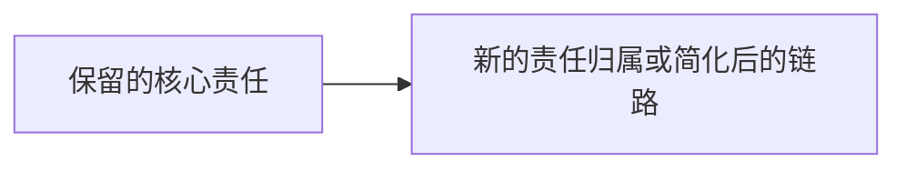

# Hai Razor 输出模板

用于审计需求、流程、字段、状态、模块、抽象或链路的存在必要性。

```markdown
# Hai Razor: <scope>

## Verdict
- **结论**: <保留核心 / 合并部分 / 延后部分 / 删除部分 / 替代当前形态 / 先证明>
- **一句话理由**: <最关键的存在必要性判断>
- **切割原则**: <这次审计用什么标准判断“值得存在”>

## 审计范围
- **链路/对象**: <PRD、流程、模块、字段列表、状态机、架构边界等>
- **当前目标**: <这条链路声称要达成什么>
- **不审计**: <本次不判断的范围，避免误切>

## 论据
| 来源 | 看到什么 | 支持/削弱哪个判断 | 置信度 |
|------|----------|------------------|--------|
| <PRD/代码/schema/指标/用户流/测试/日志/访谈等> | <具体证据> | <对应的保留、删除、合并、延后、替代或先证明判断> | 高/中/低 |

> 如果缺少论据，直接说明缺口，并把相关判断降级为“先证明”或“假设”。

## 落实前/落实后对比
<当建议改变较大的工作流、业务流程、模块链路、状态机、服务边界或架构流时必须填写；小范围局部审计可省略并说明原因。>

### 落实前


### 落实后


## Razor Map
| 概念 | 声称用途 | 删除后具体坏什么 | 隐藏承担者 | 判断 | 理由 |
|------|----------|------------------|------------|------|------|
| <概念> | <它声称解决什么> | <用户目标/不变量/安全/决策/运维是否会坏> | <谁会吸收责任> | 保留/合并/延后/删除/替代/先证明 | <判断依据> |

## 应该砍掉或合并的东西
| 概念 | 动作 | 最强存活理由 | 为什么仍然不够 |
|------|------|--------------|----------------|
| <概念> | 删除/合并/延后/替代/先证明 | <支持它留下的最强论点> | <为什么这个论点不足以证明独立存在> |

## 必须保留的复杂度
| 概念 | 保留原因 | 不能误切的边界 |
|------|----------|----------------|
| <概念> | <它保护什么目标、不变量、边界或风险> | <删到哪里会出问题> |

## 剃刀后的形态
<用短段落或列表描述删减、合并或替代后的更小模型。>

## 风险和护栏
- **可能反弹**: <未来哪里最可能把被删概念重新加回来>
- **误切风险**: <可能删掉了什么真实复杂度>
- **护栏**: <测试、验收、命名、文档、架构边界或后续证明任务>

## 下一步
<如果可以执行，列出 cut list；如果证据不足，列出 prove-first 清单；如果需要落地，转 `hai-goal`。>

## HTML 交付物
- **路径**: `/tmp/hai-razor-<slug>/index.html`
- **生成规则**: 完整审计必须生成；小范围局部审计可跳过，但要说明理由。
- **内容要求**: 结论、论据、落实前/落实后图、Razor Map、删减/合并清单、必须保留的复杂度、风险、护栏、下一步。
- **视觉要求**: 克制、清晰、可扫描；不要只把 Markdown 原样塞进 HTML。
```
